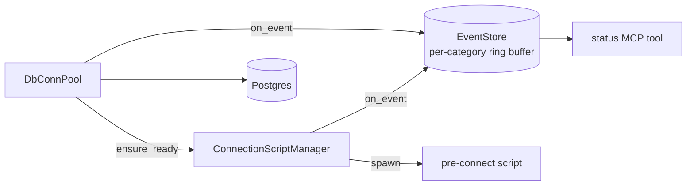
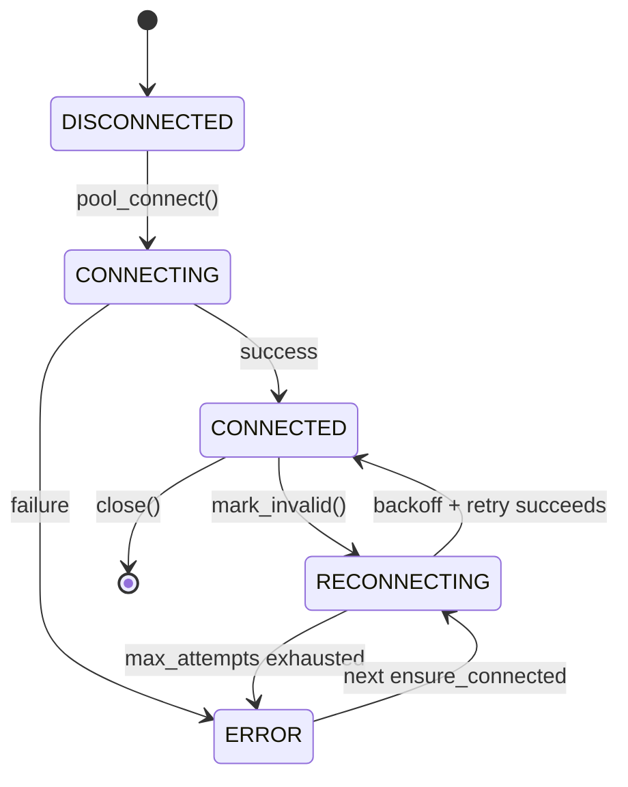
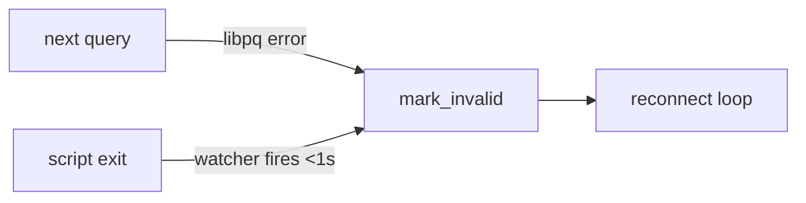
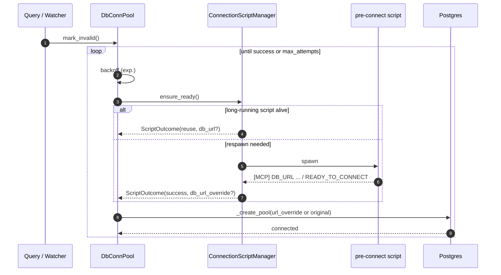
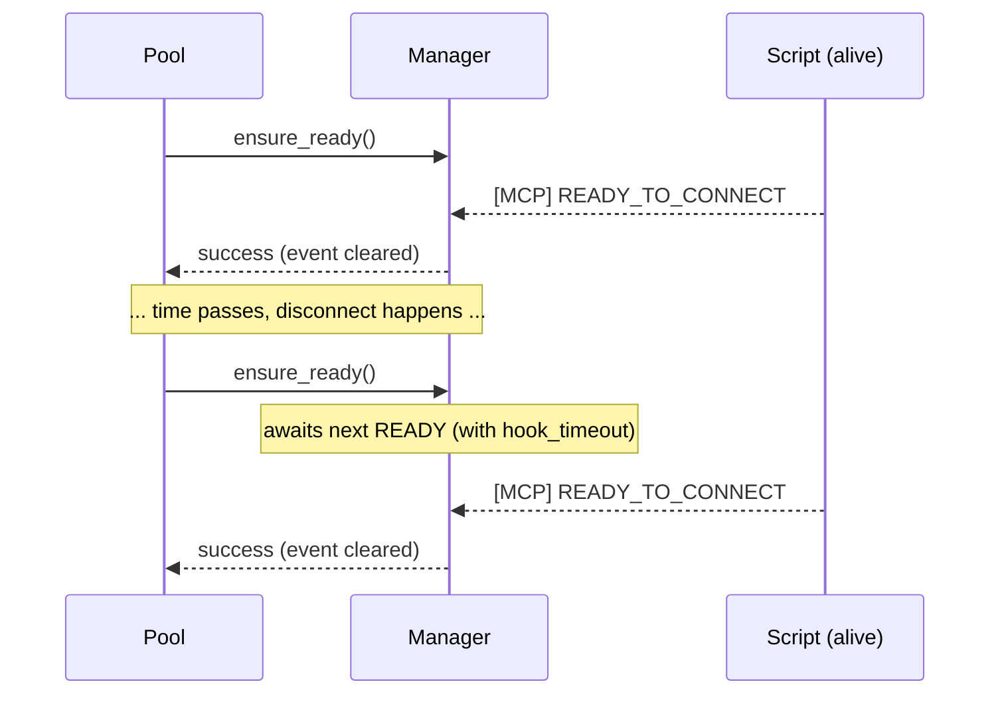
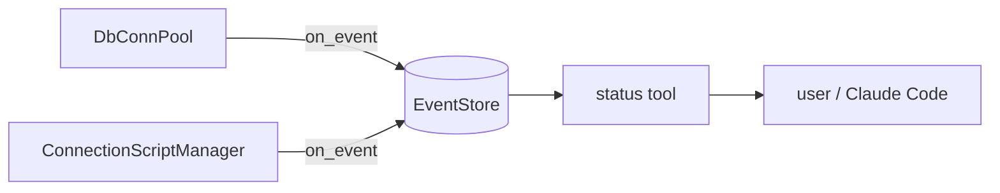
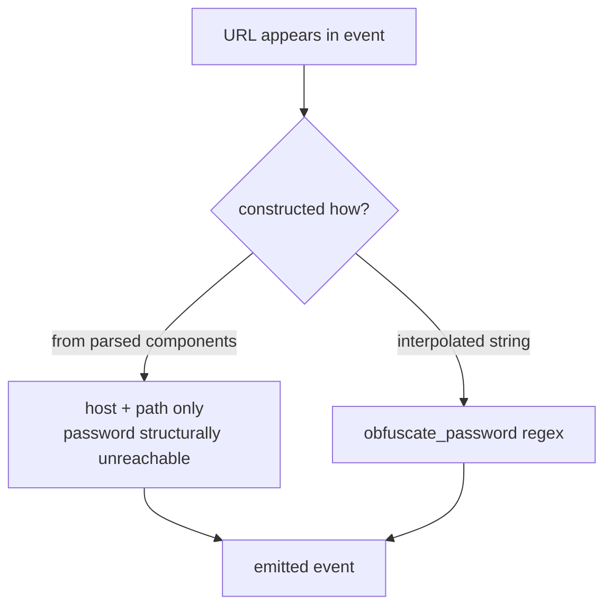

# Architecture

How connection stability, reconnection, and visibility work in
`fluid-postgres-mcp`. For the test methodology (what we break and how),
see [`TESTING-METHODOLOGY.md`](./TESTING-METHODOLOGY.md).

## Component overview

## Connection-state machine

Two trigger paths into `mark_invalid()`:

## Reconnect loop

The reconnect *loop* is separate from the *trigger*. Both reactive
(next query notices a dead conn) and proactive (script-exit watcher)
paths feed the same loop:

## Pre-connect script protocol

Mode is **inferred**, never declared:

```mermaid
flowchart TD
    spawn[spawn script] --> race{first event?}
    race -->|"exits with code 0"| RAE_OK[run-and-exit ✓]
    race -->|"exits with non-zero"| RAE_FAIL[run-and-exit ✗]
    race -->|"&#91;MCP&#93; READY_TO_CONNECT"| LR[long-running ✓ — keep alive]
    race -->|"hook_timeout"| KILL[kill + ready timeout ✗]
```

Long-running re-readiness — the `asyncio.Event` is cleared after each
return so the next `ensure_ready()` awaits a fresh signal:

## Visibility — `status` + `EventStore`

Every lifecycle transition emits an event into a bounded ring-buffer
keyed by category. The `status` MCP tool reads from it:

Two layers of credential protection in emitted events:

