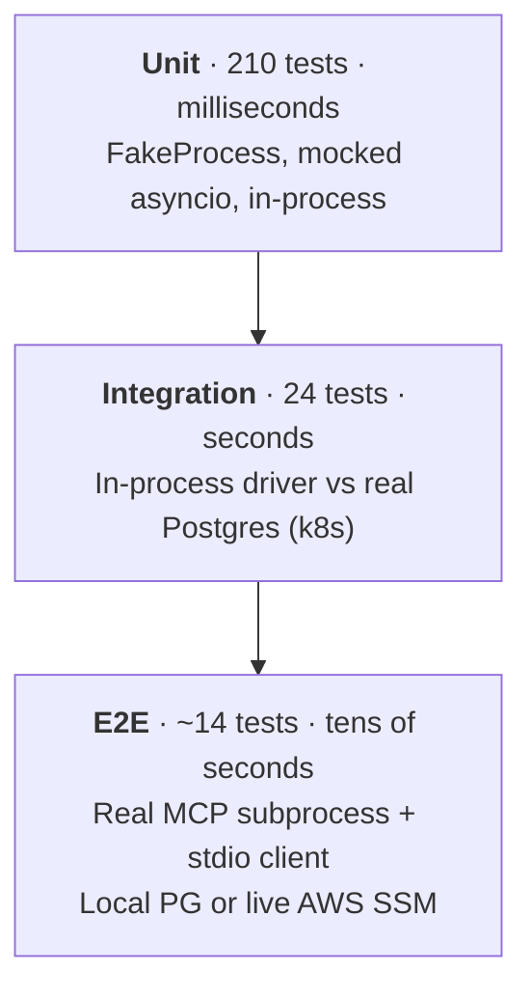
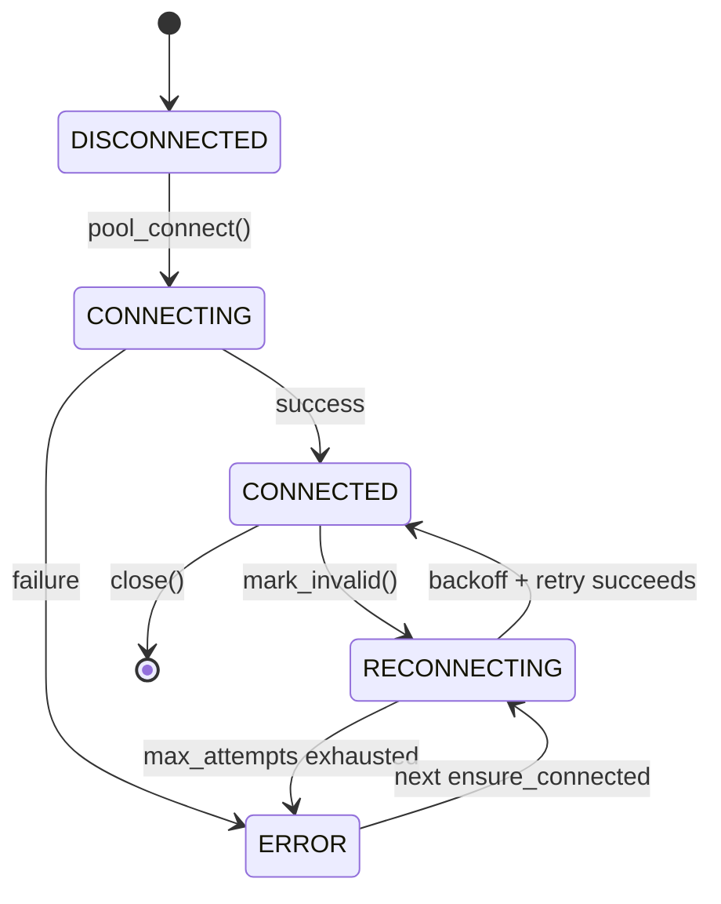
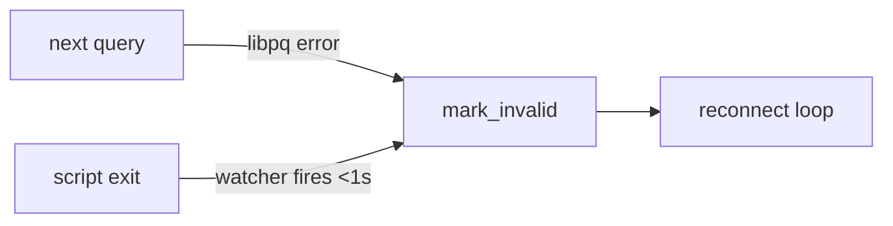
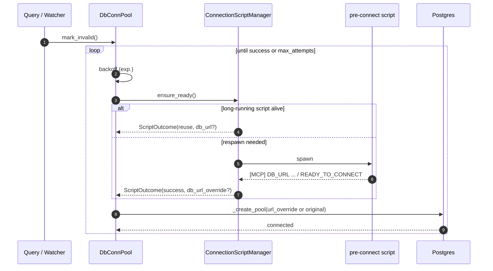
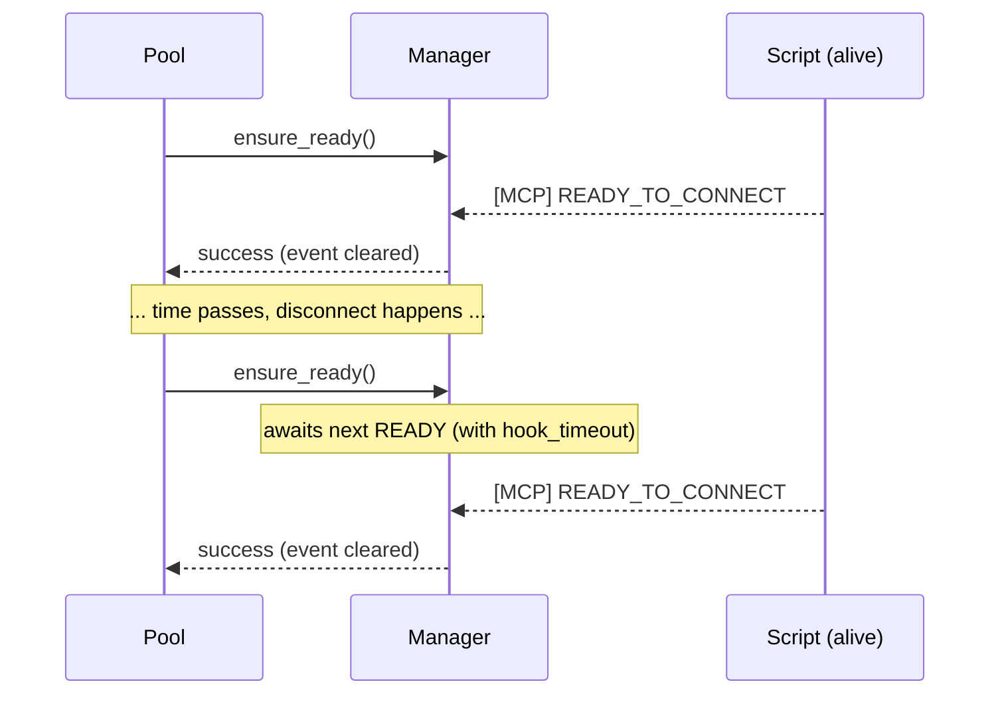
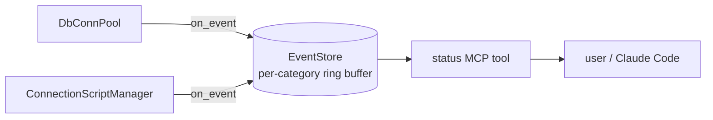
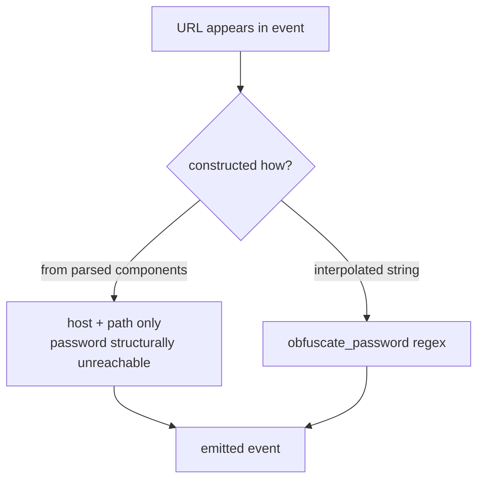
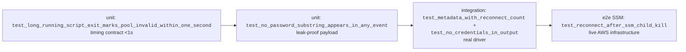

# Testing Methodology

How `fluid-postgres-mcp` is tested, with focus on **connection
stability**, **reconnection**, and **visibility** (the `status` tool +
`EventStore`).

## Test pyramid



Each property of interest is pinned at the lowest layer that can
express it, then re-verified at higher layers against real
infrastructure. Lower layers gate every commit; higher layers are run
explicitly (SSM E2E needs `aws login`).

```bash
pytest tests/unit/         # fast, no externals
pytest tests/integration/  # needs k8s-accessible Postgres
pytest tests/e2e/          # boots MCP subprocess; SSM tests need AWS
```

## Layer matrix

| Layer | Process model | Externals | What it pins |
|---|---|---|---|
| Unit | In-process; subprocess + clock fakes | None | State machines, protocol grammar, event catalogue |
| Integration | In-process driver vs real PG | k8s PG, `pg_terminate_backend` | libpq behaviour, real reconnect timing |
| E2E | Real `fluid-postgres-mcp` subprocess + MCP stdio | Local PG (or AWS SSM) | Full handshake, signal handling, `status` as users see it |

---

## Connection stability

The pool must survive any disruption that doesn't kill the host
process: terminated backends, killed tunnels, password rotation,
restarted Postgres, malformed protocol output. None of these may
crash the MCP server.



**Two trigger paths into `mark_invalid`:**



**Tests pinning this:**

| Where | What |
|---|---|
| `unit/sql/test_reconnect.py::TestCrashProtection` | reconnect never crashes the server; `ERROR` is not terminal |
| `unit/sql/test_connection_script.py::TestProactiveDisconnectWatcher` | script exit → `mark_invalid` in **<1s**; watcher only spawns in long-running mode; `close()` reaps it |
| `integration/test_reconnect.py` | `pg_terminate_backend` then query → transparent recovery; data integrity preserved |
| `e2e/test_server_lifecycle.py::TestBadConnectionString` | unreachable host on startup does not exit the process; `status` queryable |
| `e2e/test_server_lifecycle.py::TestGracefulShutdown` | SIGTERM → clean exit, no orphaned children |

---

## Reconnection

The reconnect *loop* is separate from the *trigger*. Trigger may be
reactive (next query notices a dead conn) or proactive (script-exit
watcher). Both feed the same loop.



**Tests pinning this:**

| Where | What |
|---|---|
| `unit/sql/test_reconnect.py::TestReconnectLoop` | exp. backoff timing (clock fake); max-attempts exhaustion; state transitions through `RECONNECTING` |
| `unit/sql/test_connection_script.py::TestDbConnPoolDelegatesToManager` | `ensure_ready()` runs **once** on connect, **every iteration** on reconnect — this is what enables credential rotation |
| `integration/test_pre_connect.py` | hook runs before connect, runs again on reconnect, failed hook prevents connect |
| `e2e/test_long_running_script.py` | `[MCP] DB_URL` override applied; script exit detected <1s; URL rotation across respawn; malformed `DB_URL` falls back to configured URL |
| `e2e/test_ssm_disruption.py` | tunnel kill, all-backends kill, PG stop/start, PG restart, long-running tunnel kill, credential rotation — all live AWS |

### Pre-connect script protocol

Mode is **inferred**, never declared:

```mermaid
flowchart TD
    spawn[spawn script] --> race{first event?}
    race -->|exits with code 0| RAE_OK[run-and-exit ✓]
    race -->|exits with non-zero| RAE_FAIL[run-and-exit ✗]
    race -->|<code>[MCP] READY_TO_CONNECT</code>| LR[long-running ✓ — keep alive]
    race -->|hook_timeout| KILL[kill + ready timeout ✗]
```

Long-running re-readiness — the `asyncio.Event` is cleared after each
return so the next `ensure_ready()` awaits a fresh signal:



**Protocol invariants** — all in `unit/sql/test_connection_script.py`:

| Class | Invariant |
|---|---|
| `TestScriptModeNone` | no script → `ScriptOutcome(success=True, mode=NONE)`, no subprocess |
| `TestRunAndExitMode` | exit-before-READY classified; exit code surfaces as success/failure |
| `TestLongRunningMode` | READY-then-stays-alive classified; process kept running |
| `TestHookTimeout` | silent script killed after `hook_timeout`, no orphan tasks |
| `TestProtocolGrammar` | `[MCP] KEYWORD [PAYLOAD]` form; unknown keyword warned-once-per-keyword; malformed `DB_URL` keeps prior override |
| `TestLongRunningReReadiness` | event cleared after each return; second call also enforces `hook_timeout` |
| `TestLongRunningExitDetection` | `wait_for_exit()` resolves on death; next `ensure_ready()` respawns |
| `TestSerialisationAndStop` | concurrent `ensure_ready()` shares one `_inflight` future via `asyncio.Lock` — no double-spawn |
| `TestDbUrlOverride` | override applied on initial + reconnect; survives rotation; malformed payload doesn't crash |

---

## Visibility — `status` tool + `EventStore`

When something goes wrong the operator must be able to ask the MCP
server *why* without shelling onto the box. Every lifecycle transition
emits an event to a bounded ring-buffer keyed by category.



**Two layers of credential protection:**



**Tests pinning visibility:**

| Where | What |
|---|---|
| `unit/test_event_store.py` | ring buffer wraps when full; per-category independence; UTC timestamps; configurable buffer size |
| `unit/test_status_tool.py` | `state`, `errors`, `warnings`, `events`, `metadata`, `queries` round-trip; **no connection string in any field** |
| `unit/sql/test_connection_script.py::TestEventCatalog` | the 9 documented messages emitted at correct transitions; `DB_URL` event uses host/db only; **password substring appears in no emitted message** |
| `unit/sql/test_obfuscate_password.py` | regex obfuscation correctness |
| `integration/test_status.py` | full sequence (connect → query → disconnect → reconnect) recorded in order; `reconnect_count` increments; **no creds in driver-layer error messages** |
| `e2e/test_mcp_status.py` | same surface through the MCP stdio client; **no password in status output across the wire** |

### Composition: one property × four layers

The property *"after a tunnel kill, status shows reconnect within 1
second and credentials don't leak"* is verified at:



---

## Authoring notes

- **E2E + subprocess signals:** use `McpSession` from
  `tests/e2e/mcp_client_fixtures.py` (`AsyncExitStack`-based context
  manager), not raw `stdio_client` + `ClientSession` — cancel scopes
  must enter/exit in the same task or anyio raises on shutdown.
- **macOS long-running fixtures:** `exec sleep 2147483647` so SIGTERM
  kills the PID `proc.wait()` is observing. The bash `trap`+`wait`
  pattern is unreliable on macOS — `proc.wait()` does not see SIGCHLD
  through it.
- **Unit subprocess testing:** prefer the `FakeProcess` helper in
  `test_connection_script.py` (async-iterable stdout fed by
  `feed_line()`, `wait()` completed by `set_exit_code()`) over mocking
  `asyncio.create_subprocess_exec` directly.
- **No semantic relaxation when refactoring:** move tests with the
  behaviour they cover; don't loosen assertions to make the suite
  green. Sole exception: strictly-more-informative error messages
  (e.g. task 002 story 6.3).
